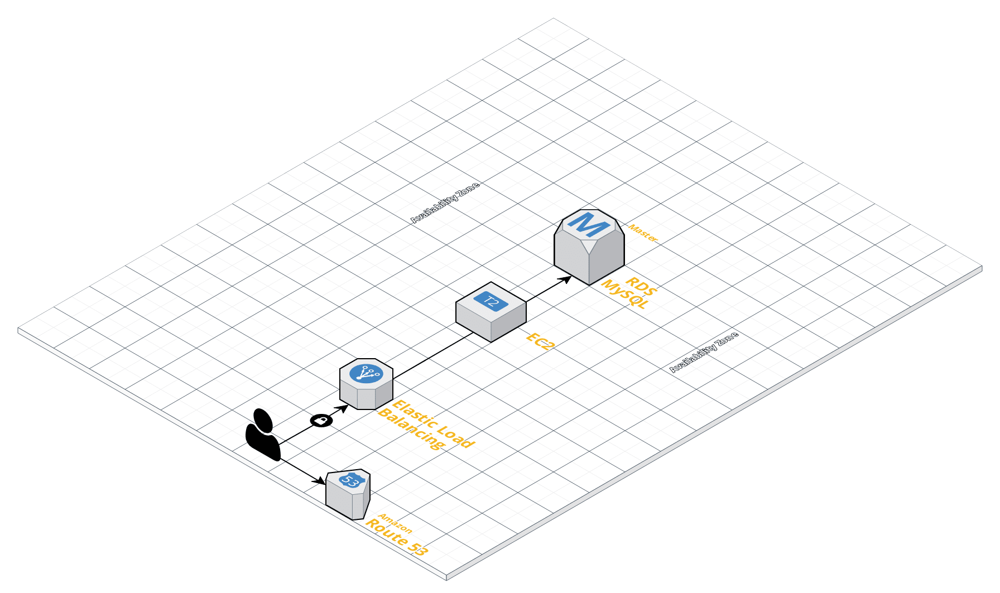

# Auto Deploy with Ansible
In this section, we will deploy a small web cluster with AMIs has create in above section. The tool will be use to create that is `Ansible`

Create `RDS`, `EC2`, `SecurityGroup`, `ELB`

### System diagram
{:class="img-responsive"}

### File Tree

In directory `ansible_deploy_aws`

```
ansible_deploy_aws
└───deploys
│   │
│   │ ec2_launch.yml
│
│
└───hosts
│   │ hosts
│
│
└───roles
    │
    └───web_cluster
        │
	    └─── tasks
	    └─── vars
	    └─── templates

```

In  the directory `tasks` define all tasks will be run to deploy  web cluster on AWS with a automating way.


### Install Ansible tool

`pip install ansible`

check `Ansible` version after installed

```
DongVo:Desktop dongvt$ ansible --version
ansible 2.6.4
  config file = None
  configured module search path = [u'/Users/dongvt/.ansible/plugins/modules', u'/usr/share/ansible/plugins/modules']
  ansible python module location = /Library/Python/2.7/site-packages/ansible
  executable location = /usr/local/bin/ansible
  python version = 2.7.10 (default, Oct  6 2017, 22:29:07) [GCC 4.2.1 Compatible Apple LLVM 9.0.0 (clang-900.0.31)]
```

### Run Ansible-playbook to deploy

NOTICE:
```
Please change infomation in roles/web_cluster/var/main.yml suitable for you before
```

`cd ansible_deploy_aws`

Check all task before deploy

```
ong:ansible_deploy_aws dongvt$ ansible-playbook -i hosts/hosts deployes/ec2_launch.yml --list-hosts --list-tasks

playbook: deployes/ec2_launch.yml

  play #1 (local): local	TAGS: []
    pattern: [u'local']
    hosts (1):
      localhost
    tasks:
      ../roles/web_cluster : Create security group ELB	TAGS: []
      ../roles/web_cluster : Create security group instance	TAGS: []
      ../roles/web_cluster : Create RDS	TAGS: []
      ../roles/web_cluster : Create EC2 instance	TAGS: []
      ../roles/web_cluster : Create load balancer	TAGS: []
Dong:ansible_deploy_aws dongvt$

```

Bite it
```
Dong:ansible_deploy_aws dongvt$ ansible-playbook -i hosts/hosts deployes/ec2_launch.yml -vv --list-hosts --list-tasks
playbook: deployes/ec2_launch.yml

  play #1 (local): local    TAGS: []
    pattern: [u'local']
    hosts (1):
      localhost
    tasks:
      ../roles/web_cluster : Create RDS TAGS: []
      ../roles/web_cluster : Create EC2 instance    TAGS: []
      ../roles/web_cluster : Create security group  TAGS: []
      ../roles/web_cluster : Create load balancer   TAGS: []
Dong:ansible_deploy_aws dongvt$
Dong:ansible_deploy_aws dongvt$ ansible-playbook -i hosts/hosts deployes/ec2_launch.yml -vvv
Parsed /Users/dongvt/Data/MYSELF/ansible_aws/ansible_deploy_aws/hosts/hosts inventory source with ini plugin

PLAYBOOK: ec2_launch.yml *********************************************************************************************************************************************
1 plays in deployes/ec2_launch.yml

PLAY [local] *********************************************************************************************************************************************************
META: ran handlers

TASK [../roles/web_cluster : Create security group ELB] **************************************************************************************************************
ok: [localhost] => {
    "changed": false,
    "description": "Ansible ELB security group",
    "group_id": "sg-09e4277701e88c526",
    "group_name": "elb_security_group",
    "invocation": {
        "module_args": {
            "aws_access_key": "",
            "aws_secret_key": "",
            "description": "Ansible ELB security group",
            "ec2_url": null,
            "group_id": null,
            "name": "elb_security_group",
            "profile": null,
            "purge_rules": true,
            "purge_rules_egress": true,
            "purge_tags": true,
            "region": "ap-southeast-1",
            "rules": [
                {
                    "cidr_ip": "0.0.0.0/0",
                    "from_port": 80,
                    "proto": "tcp",
                    "to_port": 80
                }
            ],
            "rules_egress": [
                {
                    "cidr_ip": "0.0.0.0/0",
                    "proto": "all"
                }
            ],
            "security_token": null,
            "state": "present",
            "tags": {
                "Name": "ELB"
            },
            "validate_certs": true,
            "vpc_id": null
        }
    },
    "ip_permissions": [
        {
            "from_port": 80,
            "ip_protocol": "tcp",
            "ip_ranges": [
                {
                    "cidr_ip": "0.0.0.0/0"
                }
            ],
            "ipv6_ranges": [],
            "prefix_list_ids": [],
            "to_port": 80,
            "user_id_group_pairs": []
        }
    ],
    "ip_permissions_egress": [
        {
            "ip_protocol": "-1",
            "ip_ranges": [
                {
                    "cidr_ip": "0.0.0.0/0"
                }
            ],
            "ipv6_ranges": [],
            "prefix_list_ids": [],
            "user_id_group_pairs": []
        }
    ],
    "owner_id": "349161024290",
    "tags": {
        "Name": "ELB"
    },
    "vpc_id": "vpc-62133705"
}

TASK [../roles/web_cluster : Create security group instance] *********************************************************************************************************
task path: /Users/dongvt/Data/MYSELF/ansible_aws/ansible_deploy_aws/roles/web_cluster/tasks/main.yml:17
ok: [localhost] => {
    "changed": false,
    "description": "Ansible INSTANCE security group",
    "group_id": "sg-09cbe8c24fe2629ab",
    "group_name": "instance_security_group",
    "invocation": {
        "module_args": {
            "aws_access_key": "",
            "aws_secret_key": "",
            "description": "Ansible INSTANCE security group",
            "ec2_url": null,
            "group_id": null,
            "name": "instance_security_group",
            "profile": null,
            "purge_rules": true,
            "purge_rules_egress": true,
            "purge_tags": true,
            "region": "ap-southeast-1",
            "rules": [
                {
                    "group_name": "instance_security_group",
                    "proto": "all"
                },
                {
                    "group_id": "sg-09e4277701e88c526",
                    "proto": "all"
                },
                {
                    "cidr_ip": "0.0.0.0/0",
                    "from_port": 22,
                    "proto": "tcp",
                    "to_port": 22
                }
            ],
            "rules_egress": [
                {
                    "cidr_ip": "0.0.0.0/0",
                    "proto": "all"
                }
            ],
            "security_token": null,
            "state": "present",
            "tags": {
                "Name": "instance"
            },
            "validate_certs": true,
            "vpc_id": null
        }
    },
    "ip_permissions": [
        {
            "ip_protocol": "-1",
            "ip_ranges": [],
            "ipv6_ranges": [],
            "prefix_list_ids": [],
            "user_id_group_pairs": [
                {
                    "group_id": "sg-09cbe8c24fe2629ab",
                    "user_id": "349161024290"
                },
                {
                    "group_id": "sg-09e4277701e88c526",
                    "user_id": "349161024290"
                }
            ]
        },
        {
            "from_port": 22,
            "ip_protocol": "tcp",
            "ip_ranges": [
                {
                    "cidr_ip": "0.0.0.0/0"
                }
            ],
            "ipv6_ranges": [],
            "prefix_list_ids": [],
            "to_port": 22,
            "user_id_group_pairs": []
        }
    ],
    "ip_permissions_egress": [
        {
            "ip_protocol": "-1",
            "ip_ranges": [
                {
                    "cidr_ip": "0.0.0.0/0"
                }
            ],
            "ipv6_ranges": [],
            "prefix_list_ids": [],
            "user_id_group_pairs": []
        }
    ],
    "owner_id": "349161024290",
    "tags": {
        "Name": "instance"
    },
    "vpc_id": "vpc-62133705"
}

TASK [../roles/web_cluster : Create RDS] *****************************************************************************************************************************
task path: /Users/dongvt/Data/MYSELF/ansible_aws/ansible_deploy_aws/roles/web_cluster/tasks/main.yml:34
changed: [localhost] => {
    "attempts": 1,
    "changed": true,
    "instance": {
        "DBName": "fileupload",
        "allocated_storage": 10,
        "auto_minor_version_upgrade": false,
        "availability_zone": "ap-southeast-1a",
        "backup_retention": 0,
        "backup_window": "14:58-15:28",
        "character_set_name": null,
        "create_time": 1536817758.776,
        "db_name": "fileupload",
        "db_subnet_groups": {
            "description": "default",
            "name": "default",
            "status": "complete",
            "subnets": [
                {
                    "availability_zone": {
                        "name": "ap-southeast-1a",
                        "provisioned_iops_capable": false
                    },
                    "identifier": "subnet-96fbc2df",
                    "status": "active"
                },
                {
                    "availability_zone": {
                        "name": "ap-southeast-1c",
                        "provisioned_iops_capable": false
                    },
                    "identifier": "subnet-7f37f326",
                    "status": "active"
                },
                {
                    "availability_zone": {
                        "name": "ap-southeast-1b",
                        "provisioned_iops_capable": false
                    },
                    "identifier": "subnet-d2beb7b5",
                    "status": "active"
                }
            ],
            "vpc_id": "vpc-62133705"
        },
        "endpoint": "mrneodiablo-testing.cyiahobqfbti.ap-southeast-1.rds.amazonaws.com",
        "engine": "mysql",
        "engine_version": "5.7.22",
        "id": "mrneodiablo-testing",
        "instance_type": "db.t2.micro",
        "iops": null,
        "latest_restorable_time": null,
        "license_model": "general-public-license",
        "maintenance_window": "fri:16:11-fri:16:41",
        "multi_zone": false,
        "option_groups": [
            {
                "option_group_name": "default:mysql-5-7",
                "status": "in-sync"
            }
        ],
        "parameter_groups": [
            {
                "parameter_apply_status": "in-sync",
                "parameter_group_name": "default.mysql5.7"
            }
        ],
        "pending_modified_values": {
            "allocated_storage": null,
            "backup_retention_period": null,
            "db_instance_class": null,
            "db_instance_identifier": null,
            "engine_version": null,
            "iops": null,
            "master_user_password": null,
            "multi_az": null,
            "port": null
        },
        "port": 3306,
        "publicly_accessible": false,
        "read_replica_source_dbinstance_identifier": null,
        "replication_source": null,
        "secondary_avaialbility_zone": null,
        "status": "available",
        "username": "mrneodiablo",
        "vpc_security_groups": "sg-09cbe8c24fe2629ab"
    },
    "invocation": {
        "module_args": {
            "apply_immediately": false,
            "aws_access_key": "",
            "aws_secret_key": "",
            "backup_retention": "0",
            "backup_window": null,
            "character_set_name": null,
            "command": "create",
            "db_engine": "MySQL",
            "db_name": "fileupload",
            "ec2_url": null,
            "engine_version": null,
            "force_failover": false,
            "instance_name": "mrneodiablo-testing",
            "instance_type": "db.t2.micro",
            "iops": null,
            "license_model": null,
            "maint_window": null,
            "multi_zone": false,
            "new_instance_name": null,
            "option_group": null,
            "parameter_group": null,
            "password": "VALUE_SPECIFIED_IN_NO_LOG_PARAMETER",
            "port": 3306,
            "profile": null,
            "publicly_accessible": "False",
            "region": "ap-southeast-1",
            "security_groups": null,
            "security_token": null,
            "size": "10",
            "snapshot": null,
            "source_instance": null,
            "subnet": null,
            "tags": null,
            "upgrade": false,
            "username": "mrneodiablo",
            "validate_certs": true,
            "vpc_security_groups": [
                "sg-09cbe8c24fe2629ab"
            ],
            "wait": true,
            "wait_timeout": 600,
            "zone": "ap-southeast-1a"
        }
    }
}

TASK [../roles/web_cluster : Create EC2 instance] ********************************************************************************************************************
task path: /Users/dongvt/Data/MYSELF/ansible_aws/ansible_deploy_aws/roles/web_cluster/tasks/main.yml:63
changed: [localhost] => {
    "changed": true,
    "instance_ids": [
        "i-01eac8845efac24e6"
    ],
    "instances": [
        {
            "ami_launch_index": "0",
            "architecture": "x86_64",
            "block_device_mapping": {
                "/dev/sda1": {
                    "delete_on_termination": false,
                    "status": "attached",
                    "volume_id": "vol-0e6c195e08e9e6ec9"
                }
            },
            "dns_name": "ec2-54-169-59-11.ap-southeast-1.compute.amazonaws.com",
            "ebs_optimized": false,
            "groups": {
                "sg-09cbe8c24fe2629ab": "instance_security_group"
            },
            "hypervisor": "xen",
            "id": "i-01eac8845efac24e6",
            "image_id": "ami-0920558d486c2fc0a",
            "instance_type": "t2.micro",
            "kernel": null,
            "key_name": "vothanhdong18_key_public",
            "launch_time": "2018-09-13T05:49:37.000Z",
            "placement": "ap-southeast-1a",
            "private_dns_name": "ip-172-31-44-212.ap-southeast-1.compute.internal",
            "private_ip": "172.31.44.212",
            "public_dns_name": "ec2-54-169-59-11.ap-southeast-1.compute.amazonaws.com",
            "public_ip": "54.169.59.11",
            "ramdisk": null,
            "region": "ap-southeast-1",
            "root_device_name": "/dev/sda1",
            "root_device_type": "ebs",
            "state": "running",
            "state_code": 16,
            "tags": {
                "Name": "new_instance"
            },
            "tenancy": "default",
            "virtualization_type": "hvm"
        }
    ],
    "invocation": {
        "module_args": {
            "assign_public_ip": null,
            "aws_access_key": "",
            "aws_secret_key": "",
            "count": 1,
            "count_tag": null,
            "ebs_optimized": false,
            "ec2_url": null,
            "exact_count": null,
            "group": null,
            "group_id": [
                "sg-09cbe8c24fe2629ab"
            ],
            "id": null,
            "image": "ami-0920558d486c2fc0a",
            "instance_ids": null,
            "instance_initiated_shutdown_behavior": null,
            "instance_profile_name": null,
            "instance_tags": {
                "Name": "new_instance"
            },
            "instance_type": "t2.micro",
            "kernel": null,
            "key_name": "vothanhdong18_key_public",
            "monitoring": false,
            "network_interfaces": null,
            "placement_group": null,
            "private_ip": null,
            "profile": null,
            "ramdisk": null,
            "region": "ap-southeast-1",
            "security_token": null,
            "source_dest_check": true,
            "spot_launch_group": null,
            "spot_price": null,
            "spot_type": "one-time",
            "spot_wait_timeout": "600",
            "state": "present",
            "tenancy": "default",
            "termination_protection": null,
            "user_data": "#!/bin/bash\n\nexport APP_DATABASE_NAME=fileupload\nexport APP_DATABASE_USER=mrneodiablo\nexport APP_DATABASE_PASS=vothanhdong1993 \nexport APP_DATABASE_HOST=mrneodiablo-testing.cyiahobqfbti.ap-southeast-1.rds.amazonaws.com\nexport APP_DATABASE_PORT=3306\n\n\nDIR_PROJECT=\"/data/http-upload-api\"\n\n# generate table\ncd ${DIR_PROJECT}/tool/\n\nbash generate_database_table.sh\nbash init_web_app.sh start\n\n\n",
            "validate_certs": true,
            "volumes": null,
            "vpc_subnet_id": null,
            "wait": true,
            "wait_timeout": "500",
            "zone": "ap-southeast-1a"
        }
    },
    "tagged_instances": []
}

TASK [../roles/web_cluster : Create load balancer] *******************************************************************************************************************
task path: /Users/dongvt/Data/MYSELF/ansible_aws/ansible_deploy_aws/roles/web_cluster/tasks/main.yml:81
changed: [localhost] => {
    "ansible_facts": {
        "ec2_elb": "info"
    },
    "changed": true,
    "elb": {
        "app_cookie_policy": null,
        "backends": [],
        "connection_draining_timeout": 300,
        "cross_az_load_balancing": "no",
        "dns_name": "elbhttpupload-1440253491.ap-southeast-1.elb.amazonaws.com",
        "health_check": {
            "healthy_threshold": 10,
            "interval": 30,
            "target": "TCP:80",
            "timeout": 5,
            "unhealthy_threshold": 2
        },
        "hosted_zone_id": "Z1LMS91P8CMLE5",
        "hosted_zone_name": "elbhttpupload-1440253491.ap-southeast-1.elb.amazonaws.com",
        "idle_timeout": 60,
        "in_service_count": 0,
        "instance_health": [
            {
                "instance_id": "i-01eac8845efac24e6",
                "reason_code": "Instance",
                "state": "OutOfService"
            }
        ],
        "instances": [
            "i-01eac8845efac24e6"
        ],
        "lb_cookie_policy": null,
        "listeners": [
            [
                80,
                80,
                "HTTP",
                "HTTP"
            ]
        ],
        "name": "elbhttpupload",
        "out_of_service_count": 1,
        "proxy_policy": null,
        "region": "ap-southeast-1",
        "scheme": "internet-facing",
        "security_group_ids": [
            "sg-09e4277701e88c526"
        ],
        "status": "created",
        "subnets": null,
        "tags": null,
        "unknown_instance_state_count": 0,
        "zones": [
            "ap-southeast-1a",
            "ap-southeast-1b"
        ]
    },
    "invocation": {
        "module_args": {
            "access_logs": null,
            "aws_access_key": "",
            "aws_secret_key": "",
            "connection_draining_timeout": null,
            "cross_az_load_balancing": null,
            "ec2_url": null,
            "health_check": {
                "healthy_threshold": 10,
                "interval": 30,
                "ping_port": 80,
                "ping_protocol": "tcp",
                "response_timeout": 5,
                "unhealthy_threshold": 2
            },
            "idle_timeout": null,
            "instance_ids": [
                "i-01eac8845efac24e6"
            ],
            "listeners": [
                {
                    "instance_port": 80,
                    "load_balancer_port": 80,
                    "protocol": "http"
                }
            ],
            "name": "elbhttpupload",
            "profile": null,
            "purge_instance_ids": false,
            "purge_listeners": true,
            "purge_subnets": false,
            "purge_zones": false,
            "region": "ap-southeast-1",
            "scheme": "internet-facing",
            "security_group_ids": [
                "sg-09e4277701e88c526"
            ],
            "security_group_names": null,
            "security_token": null,
            "state": "present",
            "stickiness": null,
            "subnets": null,
            "tags": null,
            "validate_certs": true,
            "wait": true,
            "wait_timeout": 60,
            "zones": [
                "ap-southeast-1a",
                "ap-southeast-1b"
            ]
        }
    }
}
META: ran handlers
META: ran handlers

PLAY RECAP ***********************************************************************************************************************************************************
localhost                  : ok=5    changed=3    unreachable=0    failed=0

```
