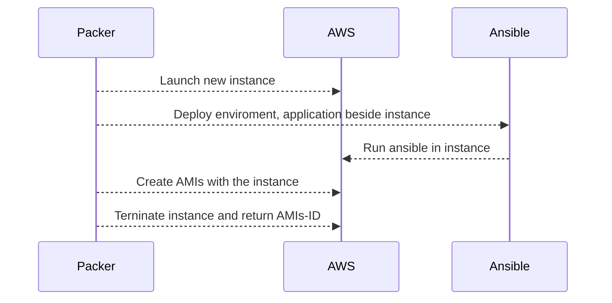

# Create AMIs
I will use  [**Packer**](https://www.packer.io/) and [**Ansible**](https://www.ansible.com/) for build new AMIs on AWS. New Image after built it will be use for launch new `Instance` of new app version.

**Packer** will build AMIs. **Ansible** in this case. it is provisioner deploy and configuration  application inside images.

### FLow




### Install  Packer:
 you can read in this link `https://www.packer.io/downloads.html` it just binary file.
```
Dong:ansible_deploy_aws dongvt$ packer version
Packer v1.2.5

Your version of Packer is out of date! The latest version
is 1.3.0. You can update by downloading from www.packer.io/downloads.html
Dong:ansible_deploy_aws dongvt$
```


### File tree
In directory `create_images_aws`

```
create_images_aws
│   packer_ami.json
│
└───sourceapp
│   │   http-upload-api.zip
│   │   file012.txt
│
└───ansible
    │   playbook.yaml
    └───roles
        └─── httpapi
	         └─── tasks
	         └─── vars

```
`sourceapp` contains `new version of application`.
`ansible` contains file `yaml` those are file define tasks and configure of ansible.
`packer_ami.json` this is important file, this file of `Packer` define  how to build AMIs.


### Build AMIs:
In directory `create_images_aws`
Run:

```
Dong:create_images_aws dongvt$ packer build packer_ami.json
AWS AMI Builder output will be in this color.
==> AWS AMI Builder: Prevalidating AMI Name: centos-http-upload-1536787375
    AWS AMI Builder: Found Image ID: ami-8e0205f2
==> AWS AMI Builder: Creating temporary keypair: packer_5b9983af-f72d-0cba-746f-43ec8854ca2d
==> AWS AMI Builder: Creating temporary security group for this instance: packer_5b9983b0-17fb-f7b7-ef26-b36e4570f77c
==> AWS AMI Builder: Authorizing access to port 22 from 0.0.0.0/0 in the temporary security group...
==> AWS AMI Builder: Launching a source AWS instance...
==> AWS AMI Builder: Adding tags to source instance
    AWS AMI Builder: Adding tag: "Name": "Packer Builder"
    AWS AMI Builder: Instance ID: i-027df028ac5c0dac4
==> AWS AMI Builder: Waiting for instance (i-027df028ac5c0dac4) to become ready...
==> AWS AMI Builder: Waiting for SSH to become available...
==> AWS AMI Builder: Connected to SSH!
==> AWS AMI Builder: Provisioning with shell script: /var/folders/dt/mj3b_45x2t19hqvg8lw7qyr40000gp/T/packer-shell352556467

==> AWS AMI Builder: Stopping the source instance...
    AWS AMI Builder: Stopping instance, attempt 1
==> AWS AMI Builder: Waiting for the instance to stop...
==> AWS AMI Builder: Creating the AMI: centos-http-upload-1536787375
    AWS AMI Builder: AMI: ami-0920558d486c2fc0a
==> AWS AMI Builder: Waiting for AMI to become ready...
==> AWS AMI Builder: Terminating the source AWS instance...
==> AWS AMI Builder: Cleaning up any extra volumes...
==> AWS AMI Builder: Destroying volume (vol-07b3ff90596c1432a)...
==> AWS AMI Builder: Deleting temporary security group...
==> AWS AMI Builder: Deleting temporary keypair...
Build 'AWS AMI Builder' finished.

==> Builds finished. The artifacts of successful builds are:
--> AWS AMI Builder: AMIs were created:
ap-southeast-1: ami-0920558d486c2fc0a
```
You can see ami has created with id `ami-0920558d486c2fc0a`
