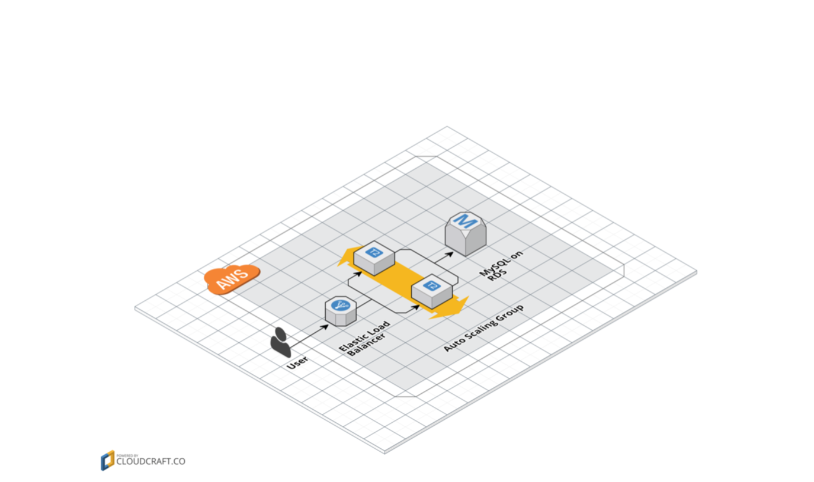

# Auto deploy with Terraform
In this section, we will deploy a small web cluster with AMIs has create in above section. The tool will be use to create that is `Terraform`

Create `RDS`, `EC2`, `SecurityGroup`, `ELB`, `AutoScalingGroup`

### System diagram



### Install  Terraform:

you can read in this link `https://www.terraform.io/` it just binary file.

```
Dong:ansible_deploy_aws dongvt$ terraform version
Terraform v0.11.8
```


### File Tree

```
 modules
      └ services
          └ webserver-cluster

live
  └ stage
      └ services
          └ webserver-cluster
      └ data-stores
            └ mysql
  └ prod
      └ services
          └ webserver-cluster
      └ data-stores
          └ mysql

  └ global
      └ s3
```

### Run terraform


#### Create RDS

**Check Terraform**

Before run `terraform apply` we need to run some command for check code and explain stats

```
Dong:mysql dongvt$ terraform plan
Refreshing Terraform state in-memory prior to plan...
The refreshed state will be used to calculate this plan, but will not be
persisted to local or remote state storage.

aws_db_instance.db: Refreshing state... (ID: terraform-20180909184319967500000001)

------------------------------------------------------------------------

An execution plan has been generated and is shown below.
Resource actions are indicated with the following symbols:
  + create

Terraform will perform the following actions:

  + module.database.aws_db_instance.db
      id:                         <computed>
      address:                    <computed>
      allocated_storage:          "10"
      apply_immediately:          <computed>
      arn:                        <computed>
      auto_minor_version_upgrade: "true"
      availability_zone:          <computed>
      backup_retention_period:    <computed>
      backup_window:              <computed>
      ca_cert_identifier:         <computed>
      character_set_name:         <computed>
      copy_tags_to_snapshot:      "false"
      db_subnet_group_name:       <computed>
      endpoint:                   <computed>
      engine:                     "mysql"
      engine_version:             <computed>
      hosted_zone_id:             <computed>
      identifier:                 <computed>
      identifier_prefix:          <computed>
      instance_class:             "db.t2.micro"
      kms_key_id:                 <computed>
      license_model:              <computed>
      maintenance_window:         <computed>
      monitoring_interval:        "0"
      monitoring_role_arn:        <computed>
      multi_az:                   <computed>
      name:                       "database_prod_db"
      option_group_name:          <computed>
      parameter_group_name:       <computed>
      password:                   <sensitive>
      port:                       <computed>
      publicly_accessible:        "false"
      replicas.#:                 <computed>
      resource_id:                <computed>
      skip_final_snapshot:        "true"
      status:                     <computed>
      storage_type:               <computed>
      timezone:                   <computed>
      username:                   "admin"
      vpc_security_group_ids.#:   <computed>


Plan: 1 to add, 0 to change, 0 to destroy.

------------------------------------------------------------------------

Note: You didn't specify an "-out" parameter to save this plan, so Terraform
can't guarantee that exactly these actions will be performed if
"terraform apply" is subsequently run.
```

**Run Terraform**


```
Dong:mysql dongvt$ terraform apply
aws_db_instance.db: Refreshing state... (ID: terraform-20180909184319967500000001)

An execution plan has been generated and is shown below.
Resource actions are indicated with the following symbols:
  + create

Terraform will perform the following actions:

  + module.database.aws_db_instance.db
      id:                         <computed>
      address:                    <computed>
      allocated_storage:          "10"
      apply_immediately:          <computed>
      arn:                        <computed>
      auto_minor_version_upgrade: "true"
      availability_zone:          <computed>
      backup_retention_period:    <computed>
      backup_window:              <computed>
      ca_cert_identifier:         <computed>
      character_set_name:         <computed>
      copy_tags_to_snapshot:      "false"
      db_subnet_group_name:       <computed>
      endpoint:                   <computed>
      engine:                     "mysql"
      engine_version:             <computed>
      hosted_zone_id:             <computed>
      identifier:                 <computed>
      identifier_prefix:          <computed>
      instance_class:             "db.t2.micro"
      kms_key_id:                 <computed>
      license_model:              <computed>
      maintenance_window:         <computed>
      monitoring_interval:        "0"
      monitoring_role_arn:        <computed>
      multi_az:                   <computed>
      name:                       "database_prod_db"
      option_group_name:          <computed>
      parameter_group_name:       <computed>
      password:                   <sensitive>
      port:                       <computed>
      publicly_accessible:        "false"
      replicas.#:                 <computed>
      resource_id:                <computed>
      skip_final_snapshot:        "true"
      status:                     <computed>
      storage_type:               <computed>
      timezone:                   <computed>
      username:                   "admin"
      vpc_security_group_ids.#:   <computed>


Plan: 1 to add, 0 to change, 0 to destroy.

Do you want to perform these actions?
  Terraform will perform the actions described above.
  Only 'yes' will be accepted to approve.

  Enter a value: yes

module.database.aws_db_instance.db: Creating...
  address:                    "" => "<computed>"
  allocated_storage:          "" => "10"
  apply_immediately:          "" => "<computed>"
  arn:                        "" => "<computed>"
  auto_minor_version_upgrade: "" => "true"
  availability_zone:          "" => "<computed>"
  backup_retention_period:    "" => "<computed>"
  backup_window:              "" => "<computed>"
  ca_cert_identifier:         "" => "<computed>"
  character_set_name:         "" => "<computed>"
  copy_tags_to_snapshot:      "" => "false"
  db_subnet_group_name:       "" => "<computed>"
  endpoint:                   "" => "<computed>"
  engine:                     "" => "mysql"
  engine_version:             "" => "<computed>"
  hosted_zone_id:             "" => "<computed>"
  identifier:                 "" => "<computed>"
  identifier_prefix:          "" => "<computed>"
  instance_class:             "" => "db.t2.micro"
  kms_key_id:                 "" => "<computed>"
  license_model:              "" => "<computed>"
  maintenance_window:         "" => "<computed>"
  monitoring_interval:        "" => "0"
  monitoring_role_arn:        "" => "<computed>"
  multi_az:                   "" => "<computed>"
  name:                       "" => "database_prod_db"
  option_group_name:          "" => "<computed>"
  parameter_group_name:       "" => "<computed>"
  password:                   "<sensitive>" => "<sensitive>"
  port:                       "" => "<computed>"
  publicly_accessible:        "" => "false"
  replicas.#:                 "" => "<computed>"
  resource_id:                "" => "<computed>"
  skip_final_snapshot:        "" => "true"
  status:                     "" => "<computed>"
  storage_type:               "" => "<computed>"
  timezone:                   "" => "<computed>"
  username:                   "" => "admin"
  vpc_security_group_ids.#:   "" => "<computed>"
module.database.aws_db_instance.db: Still creating... (10s elapsed)
module.database.aws_db_instance.db: Still creating... (20s elapsed)
module.database.aws_db_instance.db: Still creating... (30s elapsed)
module.database.aws_db_instance.db: Still creating... (40s elapsed)
module.database.aws_db_instance.db: Still creating... (50s elapsed)
module.database.aws_db_instance.db: Still creating... (1m0s elapsed)
module.database.aws_db_instance.db: Still creating... (1m10s elapsed)
module.database.aws_db_instance.db: Still creating... (1m20s elapsed)
module.database.aws_db_instance.db: Still creating... (1m30s elapsed)
module.database.aws_db_instance.db: Still creating... (1m40s elapsed)
module.database.aws_db_instance.db: Still creating... (1m50s elapsed)
module.database.aws_db_instance.db: Still creating... (2m0s elapsed)
module.database.aws_db_instance.db: Still creating... (2m10s elapsed)
module.database.aws_db_instance.db: Still creating... (2m20s elapsed)
module.database.aws_db_instance.db: Still creating... (2m30s elapsed)
module.database.aws_db_instance.db: Still creating... (2m40s elapsed)
module.database.aws_db_instance.db: Still creating... (2m50s elapsed)
module.database.aws_db_instance.db: Still creating... (3m0s elapsed)
module.database.aws_db_instance.db: Still creating... (3m10s elapsed)
module.database.aws_db_instance.db: Still creating... (3m20s elapsed)
module.database.aws_db_instance.db: Still creating... (3m30s elapsed)
module.database.aws_db_instance.db: Still creating... (3m40s elapsed)
module.database.aws_db_instance.db: Still creating... (3m50s elapsed)
module.database.aws_db_instance.db: Still creating... (4m0s elapsed)
module.database.aws_db_instance.db: Still creating... (4m10s elapsed)
module.database.aws_db_instance.db: Still creating... (4m20s elapsed)
module.database.aws_db_instance.db: Creation complete after 4m21s (ID: terraform-20180913101606510300000001)

Apply complete! Resources: 1 added, 0 changed, 0 destroyed.

Outputs:

database_address = terraform-20180913101606510300000001.cyiahobqfbti.ap-southeast-1.rds.amazonaws.com
database_port = 3306
```


#### Create Web cluster

**Check  and Run Terraform**

```
Dong:webserver-cluster dongvt$ terraform plan
Refreshing Terraform state in-memory prior to plan...
The refreshed state will be used to calculate this plan, but will not be
persisted to local or remote state storage.

data.template_file.user_data_new: Refreshing state...
data.aws_availability_zones.all: Refreshing state...

------------------------------------------------------------------------

An execution plan has been generated and is shown below.
Resource actions are indicated with the following symbols:
  + create

Terraform will perform the following actions:

  + module.database.aws_db_instance.db
      id:                                     <computed>
      address:                                <computed>
      allocated_storage:                      "10"
      apply_immediately:                      <computed>
      arn:                                    <computed>
      auto_minor_version_upgrade:             "true"
      availability_zone:                      <computed>
      backup_retention_period:                <computed>
      backup_window:                          <computed>
      ca_cert_identifier:                     <computed>
      character_set_name:                     <computed>
      copy_tags_to_snapshot:                  "false"
      db_subnet_group_name:                   <computed>
      endpoint:                               <computed>
      engine:                                 "mysql"
      engine_version:                         <computed>
      hosted_zone_id:                         <computed>
      identifier:                             <computed>
      identifier_prefix:                      <computed>
      instance_class:                         "db.t2.micro"
      kms_key_id:                             <computed>
      license_model:                          <computed>
      maintenance_window:                     <computed>
      monitoring_interval:                    "0"
      monitoring_role_arn:                    <computed>
      multi_az:                               <computed>
      name:                                   "database_prod_db"
      option_group_name:                      <computed>
      parameter_group_name:                   <computed>
      password:                               <sensitive>
      port:                                   <computed>
      publicly_accessible:                    "false"
      replicas.#:                             <computed>
      resource_id:                            <computed>
      skip_final_snapshot:                    "true"
      status:                                 <computed>
      storage_type:                           <computed>
      timezone:                               <computed>
      username:                               "admin"
      vpc_security_group_ids.#:               <computed>

  + module.webserver_cluster.aws_autoscaling_group.scaling
      id:                                     <computed>
      arn:                                    <computed>
      availability_zones.#:                   "3"
      availability_zones.160404431:           "ap-southeast-1b"
      availability_zones.2122883929:          "ap-southeast-1c"
      availability_zones.2424750709:          "ap-southeast-1a"
      default_cooldown:                       <computed>
      desired_capacity:                       <computed>
      force_delete:                           "false"
      health_check_grace_period:              "300"
      health_check_type:                      "ELB"
      launch_configuration:                   "${aws_launch_configuration.config.id}"
      load_balancers.#:                       "1"
      load_balancers.2523883644:              "webservers-prod-elb"
      max_size:                               "10"
      metrics_granularity:                    "1Minute"
      min_elb_capacity:                       "2"
      min_size:                               "2"
      name:                                   "${var.cluster_name}-${aws_launch_configuration.config.name}"
      protect_from_scale_in:                  "false"
      service_linked_role_arn:                <computed>
      tag.#:                                  "1"
      tag.690684773.key:                      "Name"
      tag.690684773.propagate_at_launch:      "true"
      tag.690684773.value:                    "webservers-prod-scaling"
      target_group_arns.#:                    <computed>
      vpc_zone_identifier.#:                  <computed>
      wait_for_capacity_timeout:              "10m"

  + module.webserver_cluster.aws_autoscaling_schedule.scale_in_at_night
      id:                                     <computed>
      arn:                                    <computed>
      autoscaling_group_name:                 "${aws_autoscaling_group.scaling.name}"
      desired_capacity:                       "2"
      end_time:                               <computed>
      max_size:                               "10"
      min_size:                               "2"
      recurrence:                             "0 17 * * *"
      scheduled_action_name:                  "scale-in-at-night"
      start_time:                             <computed>

  + module.webserver_cluster.aws_autoscaling_schedule.scale_out_during_business_hours
      id:                                     <computed>
      arn:                                    <computed>
      autoscaling_group_name:                 "${aws_autoscaling_group.scaling.name}"
      desired_capacity:                       "10"
      end_time:                               <computed>
      max_size:                               "10"
      min_size:                               "2"
      recurrence:                             "0 9 * * *"
      scheduled_action_name:                  "scale-out-during-business-hours"
      start_time:                             <computed>

  + module.webserver_cluster.aws_cloudwatch_metric_alarm.high_cpu_utilization
      id:                                     <computed>
      actions_enabled:                        "true"
      alarm_name:                             "webservers-prod-high-cpu-utilization"
      arn:                                    <computed>
      comparison_operator:                    "GreaterThanThreshold"
      dimensions.%:                           <computed>
      evaluate_low_sample_count_percentiles:  <computed>
      evaluation_periods:                     "1"
      metric_name:                            "CPUUtilization"
      namespace:                              "AWS/EC2"
      period:                                 "300"
      statistic:                              "Average"
      threshold:                              "90"
      treat_missing_data:                     "missing"
      unit:                                   "Percent"

  + module.webserver_cluster.aws_cloudwatch_metric_alarm.low_cpu_credit_balance
      id:                                     <computed>
      actions_enabled:                        "true"
      alarm_name:                             "webservers-prod-low-cpu-credit-balance"
      arn:                                    <computed>
      comparison_operator:                    "LessThanThreshold"
      dimensions.%:                           <computed>
      evaluate_low_sample_count_percentiles:  <computed>
      evaluation_periods:                     "1"
      metric_name:                            "CPUCreditBalance"
      namespace:                              "AWS/EC2"
      period:                                 "300"
      statistic:                              "Minimum"
      threshold:                              "10"
      treat_missing_data:                     "missing"
      unit:                                   "Count"

  + module.webserver_cluster.aws_elb.elb
      id:                                     <computed>
      arn:                                    <computed>
      availability_zones.#:                   "3"
      availability_zones.160404431:           "ap-southeast-1b"
      availability_zones.2122883929:          "ap-southeast-1c"
      availability_zones.2424750709:          "ap-southeast-1a"
      connection_draining:                    "false"
      connection_draining_timeout:            "300"
      cross_zone_load_balancing:              "true"
      dns_name:                               <computed>
      health_check.#:                         "1"
      health_check.0.healthy_threshold:       "2"
      health_check.0.interval:                "30"
      health_check.0.target:                  "HTTP:8080/"
      health_check.0.timeout:                 "3"
      health_check.0.unhealthy_threshold:     "2"
      idle_timeout:                           "60"
      instances.#:                            <computed>
      internal:                               <computed>
      listener.#:                             "1"
      listener.3931999347.instance_port:      "8080"
      listener.3931999347.instance_protocol:  "http"
      listener.3931999347.lb_port:            "80"
      listener.3931999347.lb_protocol:        "http"
      listener.3931999347.ssl_certificate_id: ""
      name:                                   "webservers-prod-elb"
      security_groups.#:                      <computed>
      source_security_group:                  <computed>
      source_security_group_id:               <computed>
      subnets.#:                              <computed>
      zone_id:                                <computed>

  + module.webserver_cluster.aws_launch_configuration.config
      id:                                     <computed>
      associate_public_ip_address:            "false"
      ebs_block_device.#:                     <computed>
      ebs_optimized:                          <computed>
      enable_monitoring:                      "true"
      image_id:                               "ami-01da99628f381e50a"
      instance_type:                          "t2.micro"
      key_name:                               "vothanhdong18_key_public"
      name:                                   <computed>
      root_block_device.#:                    <computed>
      security_groups.#:                      <computed>
      user_data:                              "5343f8975ea456e74d9cf160f18e4debd8c07510"

  + module.webserver_cluster.aws_security_group.elb
      id:                                     <computed>
      arn:                                    <computed>
      description:                            "Managed by Terraform"
      egress.#:                               "1"
      egress.482069346.cidr_blocks.#:         "1"
      egress.482069346.cidr_blocks.0:         "0.0.0.0/0"
      egress.482069346.description:           ""
      egress.482069346.from_port:             "0"
      egress.482069346.ipv6_cidr_blocks.#:    "0"
      egress.482069346.prefix_list_ids.#:     "0"
      egress.482069346.protocol:              "-1"
      egress.482069346.security_groups.#:     "0"
      egress.482069346.self:                  "false"
      egress.482069346.to_port:               "0"
      ingress.#:                              "1"
      ingress.2214680975.cidr_blocks.#:       "1"
      ingress.2214680975.cidr_blocks.0:       "0.0.0.0/0"
      ingress.2214680975.description:         ""
      ingress.2214680975.from_port:           "80"
      ingress.2214680975.ipv6_cidr_blocks.#:  "0"
      ingress.2214680975.protocol:            "tcp"
      ingress.2214680975.security_groups.#:   "0"
      ingress.2214680975.self:                "false"
      ingress.2214680975.to_port:             "80"
      name:                                   "webservers-prod-elb"
      owner_id:                               <computed>
      revoke_rules_on_delete:                 "false"
      vpc_id:                                 <computed>

  + module.webserver_cluster.aws_security_group.instance
      id:                                     <computed>
      arn:                                    <computed>
      description:                            "Managed by Terraform"
      egress.#:                               <computed>
      ingress.#:                              "1"
      ingress.516175195.cidr_blocks.#:        "1"
      ingress.516175195.cidr_blocks.0:        "0.0.0.0/0"
      ingress.516175195.description:          ""
      ingress.516175195.from_port:            "8080"
      ingress.516175195.ipv6_cidr_blocks.#:   "0"
      ingress.516175195.protocol:             "tcp"
      ingress.516175195.security_groups.#:    "0"
      ingress.516175195.self:                 "false"
      ingress.516175195.to_port:              "8080"
      name:                                   "webservers-prod-instance"
      owner_id:                               <computed>
      revoke_rules_on_delete:                 "false"
      vpc_id:                                 <computed>


Plan: 10 to add, 0 to change, 0 to destroy.

------------------------------------------------------------------------

Note: You didn't specify an "-out" parameter to save this plan, so Terraform
can't guarantee that exactly these actions will be performed if
"terraform apply" is subsequently run.

Dong:webserver-cluster dongvt$ terraform apply
data.template_file.user_data_new: Refreshing state...
data.aws_availability_zones.all: Refreshing state...

An execution plan has been generated and is shown below.
Resource actions are indicated with the following symbols:
  + create

Terraform will perform the following actions:

  + module.database.aws_db_instance.db
      id:                                     <computed>
      address:                                <computed>
      allocated_storage:                      "10"
      apply_immediately:                      <computed>
      arn:                                    <computed>
      auto_minor_version_upgrade:             "true"
      availability_zone:                      <computed>
      backup_retention_period:                <computed>
      backup_window:                          <computed>
      ca_cert_identifier:                     <computed>
      character_set_name:                     <computed>
      copy_tags_to_snapshot:                  "false"
      db_subnet_group_name:                   <computed>
      endpoint:                               <computed>
      engine:                                 "mysql"
      engine_version:                         <computed>
      hosted_zone_id:                         <computed>
      identifier:                             <computed>
      identifier_prefix:                      <computed>
      instance_class:                         "db.t2.micro"
      kms_key_id:                             <computed>
      license_model:                          <computed>
      maintenance_window:                     <computed>
      monitoring_interval:                    "0"
      monitoring_role_arn:                    <computed>
      multi_az:                               <computed>
      name:                                   "database_prod_db"
      option_group_name:                      <computed>
      parameter_group_name:                   <computed>
      password:                               <sensitive>
      port:                                   <computed>
      publicly_accessible:                    "false"
      replicas.#:                             <computed>
      resource_id:                            <computed>
      skip_final_snapshot:                    "true"
      status:                                 <computed>
      storage_type:                           <computed>
      timezone:                               <computed>
      username:                               "admin"
      vpc_security_group_ids.#:               <computed>

  + module.webserver_cluster.aws_autoscaling_group.scaling
      id:                                     <computed>
      arn:                                    <computed>
      availability_zones.#:                   "3"
      availability_zones.160404431:           "ap-southeast-1b"
      availability_zones.2122883929:          "ap-southeast-1c"
      availability_zones.2424750709:          "ap-southeast-1a"
      default_cooldown:                       <computed>
      desired_capacity:                       <computed>
      force_delete:                           "false"
      health_check_grace_period:              "300"
      health_check_type:                      "ELB"
      launch_configuration:                   "${aws_launch_configuration.config.id}"
      load_balancers.#:                       "1"
      load_balancers.2523883644:              "webservers-prod-elb"
      max_size:                               "10"
      metrics_granularity:                    "1Minute"
      min_elb_capacity:                       "2"
      min_size:                               "2"
      name:                                   "${var.cluster_name}-${aws_launch_configuration.config.name}"
      protect_from_scale_in:                  "false"
      service_linked_role_arn:                <computed>
      tag.#:                                  "1"
      tag.690684773.key:                      "Name"
      tag.690684773.propagate_at_launch:      "true"
      tag.690684773.value:                    "webservers-prod-scaling"
      target_group_arns.#:                    <computed>
      vpc_zone_identifier.#:                  <computed>
      wait_for_capacity_timeout:              "10m"

  + module.webserver_cluster.aws_autoscaling_schedule.scale_in_at_night
      id:                                     <computed>
      arn:                                    <computed>
      autoscaling_group_name:                 "${aws_autoscaling_group.scaling.name}"
      desired_capacity:                       "2"
      end_time:                               <computed>
      max_size:                               "10"
      min_size:                               "2"
      recurrence:                             "0 17 * * *"
      scheduled_action_name:                  "scale-in-at-night"
      start_time:                             <computed>

  + module.webserver_cluster.aws_autoscaling_schedule.scale_out_during_business_hours
      id:                                     <computed>
      arn:                                    <computed>
      autoscaling_group_name:                 "${aws_autoscaling_group.scaling.name}"
      desired_capacity:                       "10"
      end_time:                               <computed>
      max_size:                               "10"
      min_size:                               "2"
      recurrence:                             "0 9 * * *"
      scheduled_action_name:                  "scale-out-during-business-hours"
      start_time:                             <computed>

  + module.webserver_cluster.aws_cloudwatch_metric_alarm.high_cpu_utilization
      id:                                     <computed>
      actions_enabled:                        "true"
      alarm_name:                             "webservers-prod-high-cpu-utilization"
      arn:                                    <computed>
      comparison_operator:                    "GreaterThanThreshold"
      dimensions.%:                           <computed>
      evaluate_low_sample_count_percentiles:  <computed>
      evaluation_periods:                     "1"
      metric_name:                            "CPUUtilization"
      namespace:                              "AWS/EC2"
      period:                                 "300"
      statistic:                              "Average"
      threshold:                              "90"
      treat_missing_data:                     "missing"
      unit:                                   "Percent"

  + module.webserver_cluster.aws_cloudwatch_metric_alarm.low_cpu_credit_balance
      id:                                     <computed>
      actions_enabled:                        "true"
      alarm_name:                             "webservers-prod-low-cpu-credit-balance"
      arn:                                    <computed>
      comparison_operator:                    "LessThanThreshold"
      dimensions.%:                           <computed>
      evaluate_low_sample_count_percentiles:  <computed>
      evaluation_periods:                     "1"
      metric_name:                            "CPUCreditBalance"
      namespace:                              "AWS/EC2"
      period:                                 "300"
      statistic:                              "Minimum"
      threshold:                              "10"
      treat_missing_data:                     "missing"
      unit:                                   "Count"

  + module.webserver_cluster.aws_elb.elb
      id:                                     <computed>
      arn:                                    <computed>
      availability_zones.#:                   "3"
      availability_zones.160404431:           "ap-southeast-1b"
      availability_zones.2122883929:          "ap-southeast-1c"
      availability_zones.2424750709:          "ap-southeast-1a"
      connection_draining:                    "false"
      connection_draining_timeout:            "300"
      cross_zone_load_balancing:              "true"
      dns_name:                               <computed>
      health_check.#:                         "1"
      health_check.0.healthy_threshold:       "2"
      health_check.0.interval:                "30"
      health_check.0.target:                  "HTTP:8080/"
      health_check.0.timeout:                 "3"
      health_check.0.unhealthy_threshold:     "2"
      idle_timeout:                           "60"
      instances.#:                            <computed>
      internal:                               <computed>
      listener.#:                             "1"
      listener.3931999347.instance_port:      "8080"
      listener.3931999347.instance_protocol:  "http"
      listener.3931999347.lb_port:            "80"
      listener.3931999347.lb_protocol:        "http"
      listener.3931999347.ssl_certificate_id: ""
      name:                                   "webservers-prod-elb"
      security_groups.#:                      <computed>
      source_security_group:                  <computed>
      source_security_group_id:               <computed>
      subnets.#:                              <computed>
      zone_id:                                <computed>

  + module.webserver_cluster.aws_launch_configuration.config
      id:                                     <computed>
      associate_public_ip_address:            "false"
      ebs_block_device.#:                     <computed>
      ebs_optimized:                          <computed>
      enable_monitoring:                      "true"
      image_id:                               "ami-01da99628f381e50a"
      instance_type:                          "t2.micro"
      key_name:                               "vothanhdong18_key_public"
      name:                                   <computed>
      root_block_device.#:                    <computed>
      security_groups.#:                      <computed>
      user_data:                              "5343f8975ea456e74d9cf160f18e4debd8c07510"

  + module.webserver_cluster.aws_security_group.elb
      id:                                     <computed>
      arn:                                    <computed>
      description:                            "Managed by Terraform"
      egress.#:                               "1"
      egress.482069346.cidr_blocks.#:         "1"
      egress.482069346.cidr_blocks.0:         "0.0.0.0/0"
      egress.482069346.description:           ""
      egress.482069346.from_port:             "0"
      egress.482069346.ipv6_cidr_blocks.#:    "0"
      egress.482069346.prefix_list_ids.#:     "0"
      egress.482069346.protocol:              "-1"
      egress.482069346.security_groups.#:     "0"
      egress.482069346.self:                  "false"
      egress.482069346.to_port:               "0"
      ingress.#:                              "1"
      ingress.2214680975.cidr_blocks.#:       "1"
      ingress.2214680975.cidr_blocks.0:       "0.0.0.0/0"
      ingress.2214680975.description:         ""
      ingress.2214680975.from_port:           "80"
      ingress.2214680975.ipv6_cidr_blocks.#:  "0"
      ingress.2214680975.protocol:            "tcp"
      ingress.2214680975.security_groups.#:   "0"
      ingress.2214680975.self:                "false"
      ingress.2214680975.to_port:             "80"
      name:                                   "webservers-prod-elb"
      owner_id:                               <computed>
      revoke_rules_on_delete:                 "false"
      vpc_id:                                 <computed>

  + module.webserver_cluster.aws_security_group.instance
      id:                                     <computed>
      arn:                                    <computed>
      description:                            "Managed by Terraform"
      egress.#:                               <computed>
      ingress.#:                              "1"
      ingress.516175195.cidr_blocks.#:        "1"
      ingress.516175195.cidr_blocks.0:        "0.0.0.0/0"
      ingress.516175195.description:          ""
      ingress.516175195.from_port:            "8080"
      ingress.516175195.ipv6_cidr_blocks.#:   "0"
      ingress.516175195.protocol:             "tcp"
      ingress.516175195.security_groups.#:    "0"
      ingress.516175195.self:                 "false"
      ingress.516175195.to_port:              "8080"
      name:                                   "webservers-prod-instance"
      owner_id:                               <computed>
      revoke_rules_on_delete:                 "false"
      vpc_id:                                 <computed>


Plan: 10 to add, 0 to change, 0 to destroy.

Do you want to perform these actions?
  Terraform will perform the actions described above.
  Only 'yes' will be accepted to approve.

  Enter a value: yes
```

==> Done
